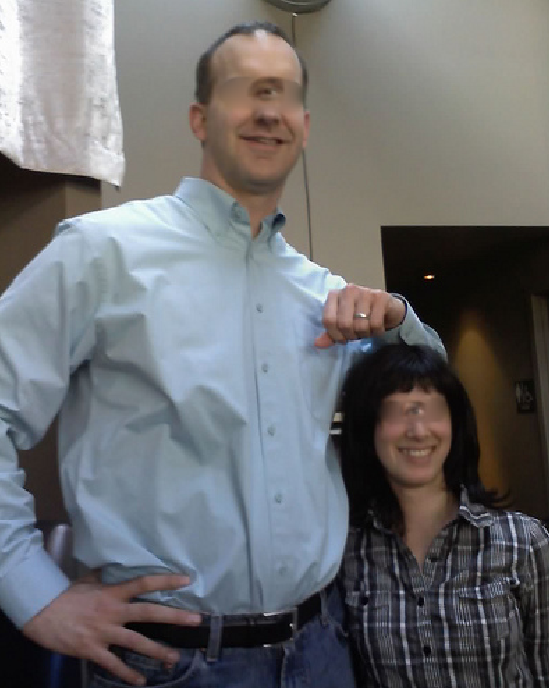
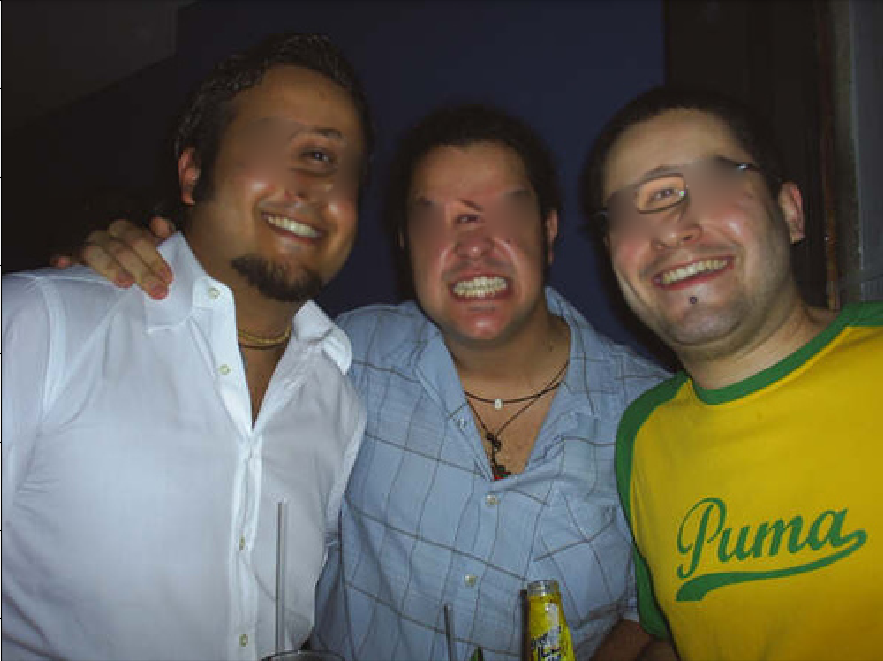

# CyclopsMe

A whimsical project to automatically turn every face in an image into a cyclops face.  Uses dlib to detect facial landmarks and Poisson image editing to blend the eye in a new location.  

  

